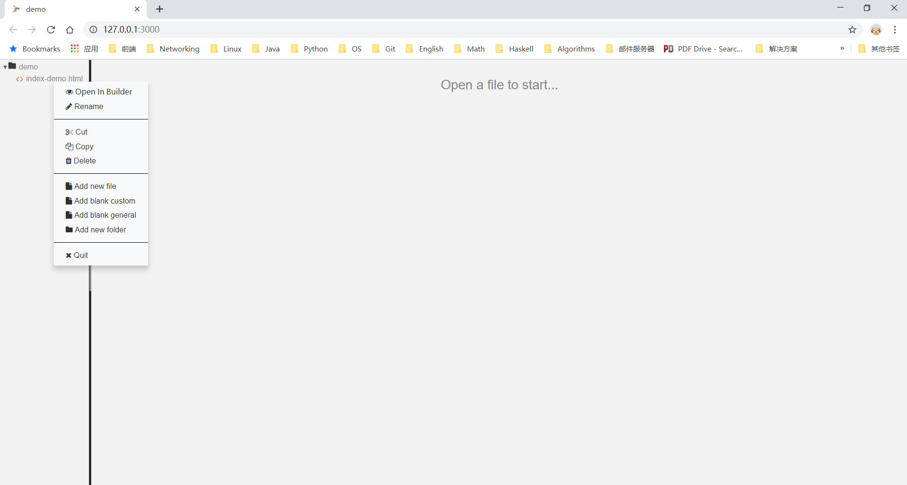
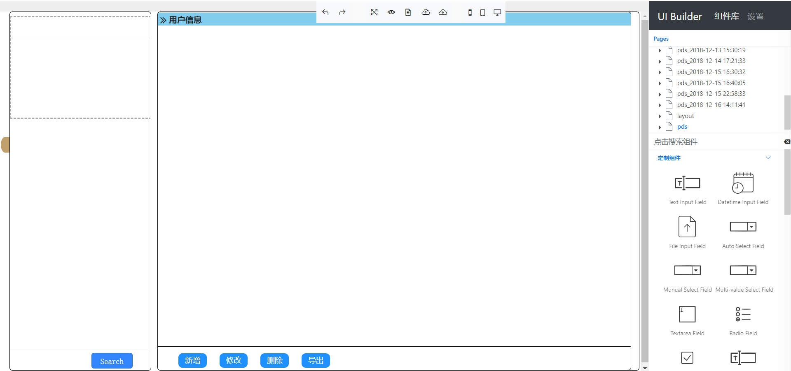
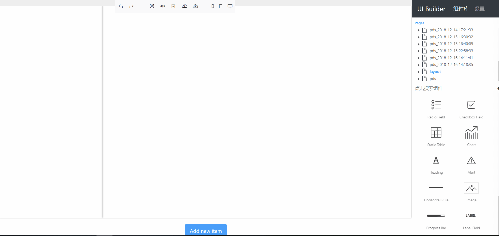
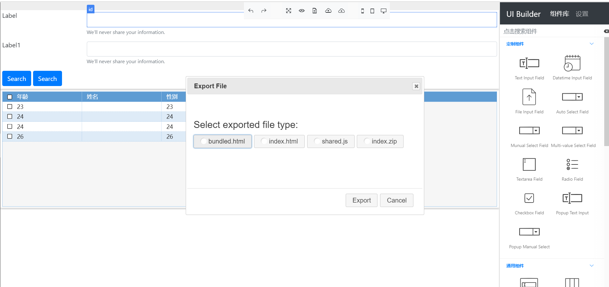
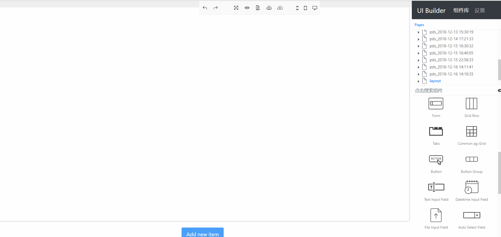

# UI Tools

---

## UI Tools程序版说明、本地安装和配置

UI Tools程序版是依赖网页版，支持用户在浏览器中使用网页版的功能并实现浏览器和本地文件系统双向同步的程序。程序版定期发布压缩包，包含程序、程序配置文件和项目依赖文件夹。

---

### 压缩文件说明

    node.zip
    │
    └───www                       # 项目依赖的样式和脚本文件
    │   │
    │   └───css
    │   └───fonts
    │   └───html
    │   └───js
    │
    └───noide.bin.zip             # 程序文件和配置文件
        │   noide.config.json     # 配置文件，配置说明参见noide.config.md
        │   noide.config.md       # 配置说明文件
        │   noide.exe             # 程序文件
        │   RunHide.vbs           # 支持程序后台运行的脚本文件，可忽略
        │   shutdown.bat          # 关闭脚本
        │   startup.bat           # 启动脚本

### 本地安装和配置

双击noide.exe启动程序，程序前台运行，程序启动时右侧文件树列表是当前程序所在路径的文件树。程序支持多实例，启动时绑定不同的端口。双击startup.bat启动程序，程序后台运行。双击shutup.bat关闭所有运行的程序实例。如果需要同时启动多个实例，同时支持单独关闭，请双击noide.exe启动程序，并通过右上角关闭想要关闭的程序。


### 功能介绍

页面分为左右两部分，左侧为文件树列表，右侧是工作区域。工作区域可以分别以编辑器模式和UI Tools模式显示。



快捷菜单支持新增、删除和重命名文件和文件夹操作，并根据文件类型显示不同的菜单。

后缀名为html的页面右键点击时，支持以Builder模式打开，打开后右侧工作区展示与网页版相同的内容。用户可以在右侧工作区域进行与网页版相同的操作，所有的修改变化会同步到本地的文件。左键单击文件时，文件以编辑器模式打开，可以查看文件变化，同时可以进行编辑操作，所有的编辑操作会同步到本地的文件中。

`Add blank custom`和`Add blank general`两个快捷菜单分别创建空白的定制和通用模板文件，用户可以通过Builder模式打开对应的文件，进行编辑操作。

压缩包`www/js/shared.js`文件中包含压缩包打包时最新的公共脚本文件。程序公共脚本因为需要支持新功能和修复问题，可能需要不定期更新。为了确保`shared.js`保证最新，右击后缀名为js的文件，显示Update shared JavaScript菜单。单击后，程序会使用最新的公共脚本覆盖原有文件。

!!! warning "警告"
    更新脚本文件时，请确保更新的是公共脚本文件。请不要将定制的逻辑代码写入公共的脚本文件，更新操作会覆盖原有的文件。

#### Builder模式

工作区域以Builder模式打开后，界面和操作方式与网页版类似，将在[**Components**](#components)组件介绍中详细介绍具体使用方式。

#### 编辑器模式

##### 编辑器模式快捷键支持

|PC (Windows/Linux)|Mac|action|
|--- |--- |--- |
|++ctrl+s++|++command+s++|Save the current file|
|++ctrl+shift+s++,|++command+option+s++,|Save all files|
|++ctrl+b++|++command+b++|Beautify (js, css, html files only)|
|++ctrl++|++command++|Show the settings menu|
|++ctrl+alt+up++|++ctrl+option+up++|add multi+cursor above|
|++ctrl+alt+down++|++ctrl+option+down++|add multi+cursor below|
|++ctrl+alt+right++|++ctrl+option+right++|add next occurrence to multi+selection|
|++ctrl+alt+left++|++ctrl+option+left++|add previous occurrence to multi+selection|
||++ctrl+l++|center selection|
|++ctrl+shift+u++|++ctrl+shift+u++|change to lower case|
|++ctrl+u++|++ctrl+u++|change to upper case|
|++alt+shift+down++|++command+option+down++|copy lines down|
|++alt+shift+up++|++command+option+up++|copy lines up|
|++delete++||delete|
|++ctrl+shift+d++|++command+shift++|duplicate selection|
|++ctrl+f++|++command++|find|
|++ctrl+k++|++command+g++|find next|
|++ctrl+shift+k++|++command+shift+g++|find previous|
|++alt+0++|++command+option+0++|fold all|
|++alt+l++, ++ctrl+f1++|++command+option+l++, ++command+f1++|fold selection|
|++down++|++down++, ++ctrl+n++|go line down|
|++up++|++up++, ++ctrl+p++|go line up|
|++ctrl+end++|++command+end++, ++command+down++|go to end|
|++left++|++left++, ++ctrl+b++|go to left|
|++ctrl+l++|++command+l++|go to line|
|++alt+right++, ++end++|++command+right++, ++end++, ++ctrl+e++|go to line end|
|++alt+left++, ++home++|++command+left++, ++home++, ++ctrl+a++|go to line start|
|++ctrl+p++||go to matching bracket|
|++page-down++|++option+page-down++, ++ctrl+v++|go to page down|
|++page-up++|++option+page-up++|go to page up|
|++right++|++right++, ++ctrl+f++|go to right|
|++ctrl+home++|++command+home++, ++command+up++|go to start|
|++ctrl+left++|++option+left++|go to word left|
|++ctrl+right++|++option+right++|go to word right|
|++tab++|++tab++|indent|
|++ctrl+alt+e++||macros recording|
|++ctrl+shift+e++|++command+shift+e++|macros replay|
|++alt+down++|++option+down++|move lines down|
|++alt+up++|++option+up++|move lines up|
|++ctrl+alt+shift+up++|++ctrl+option+shift+up++|move multicursor from current line to the line above|
|++ctrl+alt+shift+down++|++ctrl+option+shift+down++|move multicursor from current line to the line below|
|++shift+tab++|++shift+tab++|outdent|
|++insert++|++insert++|overwrite|
|++ctrl+shift+z++, ++ctrl+y++|++command+shift+z++, ++command+y++|redo|
|++ctrl+alt+shift+right++|++ctrl+option+shift+right++|remove current occurrence from multi+selection and move to next|
|++ctrl+alt+shift+left++|++ctrl+option+shift+left++|remove current occurrence from multi+selection and move to previous|
|++ctrl+d++|++command+d++|remove line|
|++alt+delete++|++ctrl+k++|remove to line end|
|++alt+backspace++|++command+backspace++|remove to linestart|
|++ctrl+backspace++|++option+backspace++, ++ctrl+option+backspace++|remove word left|
|++ctrl+delete++|++option+delete++|remove word right|
|++ctrl+r++|++command+option+f++|replace|
|++ctrl+shift+r++|++command+shift+option+f++|replace all|
|++ctrl+down++|++command+down++|scroll line down|
|++ctrl+up++||scroll line up|
||++option+page-down++|scroll page down|
||++option+page-up++|scroll page up|
|++ctrl+a++|++command+a++|select all|
|++ctrl+shift+l++|++ctrl+shift+l++|select all from multi+selection|
|++shift+down++|++shift+down++|select down|
|++shift+left++|++shift+left++|select left|
|++shift+end++|++shift+end++|select line end|
|++shift+home++|++shift+home++|select line start|
|++shift+page-down++|++shift+page-down++|select page down|
|++shift+page-up++|++shift+page-up++|select page up|
|++shift+right++|++shift+right++|select right|
|++ctrl+shift+end++|++command+shift+down++|select to end|
|++alt+shift+right++|++command+shift+right++|select to line end|
|++alt+shift+left++|++command+shift+left++|select to line start|
|++ctrl+shift+p++||select to matching bracket|
|++ctrl+shift+home++|++command+shift+up++|select to start|
|++shift+up++|++shift+up++|select up|
|++ctrl+shift+left++|++option+shift+left++|select word left|
|++ctrl+shift+right++|++option+shift+right++|select word right|
||++ctrl+o++|split line|
|++ctrl+slash++|++command+slash++|toggle comment|
|++ctrl+t++|++ctrl+t++|transpose letters|
|++ctrl+z++|++command+z++|undo|
|++alt+shift+l++, ++ctrl+shift+f1++|++command+option+shift+l++, ++command+shift+f1++|unfold|
|++alt+shift+0++|++command+option+shift+0++|unfold all|
|++ctrl+enter++|++command+enter++|enter full screen|

## UI Tools网页版说明和使用

---

### UI Tools网页版说明

UI Tools网页版是程序版依赖的服务，界面和功能和程序版使用Builder模式打开工作空间类似。

由于浏览器不支持直接的文件访问，UI Tools需要用户显式地进行文件的导入和导出操作。UI Tools网页版在组件列表上方会显式页面文件树。页面文件树中，显示的页面包含通用和定制的模板文件、用户基于模板文件创建的新页面和导入的页面。用户创建的页面通过`localStorage`保存到浏览器本地，支持在文件树列表删除已创建的页面。

### UI Tools网页版快捷菜单

|菜单|功能说明|快捷键|
|---|---|---|
|Undo|撤销上一步操作|++ctrl+z++|
| Redo|重做上一步操作|++ctrl+y++|
| Fullscreen|全屏显示，进入全屏模式后，按++f1++推出全屏||
| Preview|隐藏右侧功能区，全屏预览效果，此时左侧工作空间处于不可操作状态||
| Check generated file|模态框预览导出文件内容||
| Upload|上传页面到UI Tools中打开||
| Download|下载当前工作空间的页面到本地||
| Mobile View|预览当前页面在手机视图中的效果||
| Tablet View|预览当前页面在平板视图中的效果||
| Desktop View|预览当前页面在桌面视图中的效果||

### UI Tools网页版模板

#### 定制模板



定制模板是具有固定页面布局的预置模板。左侧是表单，右侧是表格或图表。

#### 通用模板



通用模板以布局块为基本单位，允许用户新增、删除布局块、调整布局块的大小、拖拽改变布局块在页面的位置并拖拽组件到布局块中定位。

### UI Tools网页版设置


#### 定制设置

定制设置是对应不同组件的设置。

#### 通用设置

通用设置是所有元素通用属性的设置。按其功能分成了*General*、*Border*、*Padding*、*Display*、*Typography*、*Size*、*Margin*等设置。方便用户对元素`id`、`class`和`style`属性进行可视化的修改。

### UI Tools网页版导出文件说明

UI Tools网页版支持导出不同类型的文件



|导出文件|文件说明|
|---|---|
|bundled.html|包含公共脚本文件的html|
|index.html|移除公共脚本文件的html，只包含必要的表格初始化文件，如需后期引入，可加入shared.js|
|shared.js|公共脚本文件|
|index.zip|包含index.html和shared.js的压缩文件|

## Components

组件是布局的最小单位。用户可以拖拽组件到对应的区域、调整它们的属性并预览效果。

---

### 定制组件

定制组件是为pds模板设计的一套具有固定宽度和高度的输入组件。

|定制组件|组件说明|
|---|--|
|[Custom Text Input Field](#custom-text-input-field)|定制文本输入|
|[Custom Datetime Input Field](#custom-datetime-input-field)|定制日期时间输入|
|[Custom File Input field](#custom-file-input-field)|定制文件输入|
|[Custom Auto Select Field](#custom-auto-select-field)|定制自动填充下拉框选项输入|
|[Custom Manual Select Field](#custom-manual-select-field)|定制手动输入下拉框选项输入|
|[Custom Multi-value Select Field](#custom-multi-value-select-field)|定制多选下拉|
|[Custom Textarea Field](#custom-textarea-field)|定制文本域输入|
|[Custom Radio Field](#custom-radio-field)|定制radio输入|
|[Custom Checkbox Field](#custom-checkbox-field)|定制checkbox输入|
|[Custom Popup Text Input](#custom-popup-text-input)|定制弹出框文本输入|
|[Custom Popup Manual Select](#custom-popup-manual-select)|定制弹出框手动输入下拉框选项输入|

#### Custom Text Input Field

#### Custom Datetime Input Field

#### Custom File Input Field

定制文件输入。

!!! tip "提示"
    文件输入在用户选择上传文件后，自动执行文件上传，成功后弹窗提示。查看**_如何覆盖通用代码_**一节了解如何实现自定义文件上传逻辑。

#### Custom Auto Select Field

定制自动填充下拉框选项输入，可以通过指定url地址，设置value和text映射，在页面加载后自动填充下拉框选项。

```js tab="自动生成下拉框选项"
function generateOptions(el, response) {
    var value = $(el).attr('data-value-mapping') || 'value';
    var text = $(el).attr('data-text-mapping') || 'text';
    response.forEach(function (option) {
        $('<option></option>')
            .val(option[value])
            .text(option[text])
            .appendTo($(el));
    });
}

[].slice.call($('body').find('[data-auto-select-id]'))
    .filter(function (el) {
        return $(el).attr('data-url');
    }).forEach(function (el) {
        $.ajax({
            url: config.fundodooApiDomainUrl + $(el).attr('data-url'),
            dataType: 'json',
            method: 'POST',
            async: true,
            success: function (response) {
                generateOptions(el, response.data);
            }
        });
    });
```

#### Custom Manual Select Field

定制手动输入下拉框选项输入，允许用户在设置菜单手动添加或删除下拉框选项。

#### Custom Multi-value Select Field

#### Custom Textarea Field

#### Custom Radio Field

定制radio输入。

!!! tip "提示"
    通过选中radio元素后弹出的快捷菜单，点击复制按钮实现快速复制radio元素。

#### Custom Checkbox Field

定制checkbox输入。

!!! tip "提示"
    通过选中checkbox元素后弹出的快捷菜单，点击复制按钮实现快速复制checkbox元素。

#### Custom Popup Text Input

定制弹出框文本输入适用于定制模板弹出框。

#### Custom Popup Manual Select

定制弹出框手动输入下拉框选项输入适用于定制模板弹出框。

!!! tip "提示"
    设置输入组件title属性，当鼠标在输入组件悬浮时，在组件右侧显示title的内容。

### 通用组件

|定制组件|组件说明|
|---|---|
|[Form](#form)|表单|
|[Grid Row](#grid-row)|栅格|
|[Tabs](#tabs)|标签页|
|[Common ag-Grid](#common-ag-grid)|集成表格组件[ag-Grid](https://www.ag-grid.com/)|
|[Button](#button)|定制多选下拉|按钮|
|[Button Group](#button-group)|按钮组|
|[Text Input Field](#text-input-field)|文本输入|
|[Datetime Input Field](#datetime-input-field)|日期时间输入|
|[File Input Field](#file-input-field)|文件输入|
|[Auto Select Field](#auto-select-field)|自动填充下拉框选项输入|
|[Manual Select Field](#manual-select-field)|手动输入下拉框选项输入|
|[Textarea Field](#textarea-field)|文本域输入|
|[Radio Field](#radio-field)|radio输入|
|[Checkbox Field](#checkbox-field)|checkbox输入|
|[Static Table](#static-table)|静态表格|
|[Chart](#chart)|图表占位符|
|[Heading](#heading)|Heading元素|
|[Alert](#alert)| 告警框|
|[Horizontal Rule](#horizontal-rule)|水平分割线|
|[Image](#image)|图片组件|
|[Progress Bar](#progress-bar)|进度条|

#### Form

Form是基于[Bootstrap](https://getbootstrap.com)中的[`Form`](https://getbootstrap.com/docs/4.1/components/forms/)实现的表单组件。表单组件中可以放入不同的输入控件并设置它们的样式。参考定制组件中类型相同的输入控件的属性设置。

示例Form表单HTML代码

```html
<form>
  <div class="form-group">
    <label for="exampleFormControlInput1">Email address</label>
    <input type="email" class="form-control" id="exampleFormControlInput1" placeholder="name@example.com">
  </div>
  <div class="form-group">
    <label for="exampleFormControlSelect1">Example select</label>
    <select class="form-control" id="exampleFormControlSelect1">
      <option>1</option>
      <option>2</option>
      <option>3</option>
      <option>4</option>
      <option>5</option>
    </select>
  </div>
  <div class="form-group">
    <label for="exampleFormControlSelect2">Example multiple select</label>
    <select multiple class="form-control" id="exampleFormControlSelect2">
      <option>1</option>
      <option>2</option>
      <option>3</option>
      <option>4</option>
      <option>5</option>
    </select>
  </div>
  <div class="form-group">
    <label for="exampleFormControlTextarea1">Example textarea</label>
    <textarea class="form-control" id="exampleFormControlTextarea1" rows="3"></textarea>
  </div>
</form>
```

!!! warning "警告"
    UI Tools没有限制输入组件一定要拖入`form`元素内。实际上，用户可以选择将输入组件放入页面内的任何可拖拽区域，并能正确呈现样式。但为了HTML的语义化，将输入组件放入`form`元素内是更合理的做法。

##### Text Input Field

##### Datetime Input Field

##### File Input Field

##### Auto Select Field

##### Manual Select Field

##### Textarea Field

##### Radio Field

##### Checkbox Field

!!! question "设置输入组件的Required属性有什么作用？"
    设置输入组件的Required属性，当表单提交时，如果表单中存在设置了Required的输入组件且该组件值为空，将弹窗提示用户输入不能为空。

#### Grid Row


栅格是基于[Bootstrap](https://getbootstrap.com)中的[`Grid`](https://getbootstrap.com/docs/4.1/layout/grid/)实现的可视化、可配置的布局组件。支持栅格的新增和删除操作，支持改变栅格中列在不同分辨率下的大小。支持拖拽其他组件到栅格中的对应位置。

#### Tabs


Tabs组件基于[jQuery UI Tabs](https://jqueryui.com/tabs/)实现。允许用户新增、删除标签页和修改标签页的标题，支持拖拽其他组件到标签页中，支持标签页的嵌套。

#### Common ag-Grid



表格组件基于[ag-Grid](https://www.ag-grid.com/)实现。用户可以通过元素快捷菜单，新增、删除、修改表头，属性设置菜单修改表格颜色主题。支持ag-Grid常用属性设置。

常用属性设置说明[^1]

|属性|说明|示例|
|---|---|---|
|Header|表头名称、字段映射、宽度、是否隐藏、禁用改变大小、删除表头|
|Checkbox Selection|第一列数据是否显示checkbox|
|Header Checkbox Selection|第一列表头是否显示checkbox，可以快速进行全选|
|Enable Resize|是否启用使用鼠标改变表头宽度|
|Auto Size Columns|表格是否根据数据列自适应改变宽度|
|Populate Headers|是否根据返回数据自动填充表头，启用后现有的Header设置失效|
|Pagination|是否分页显示数据|
|Page Size|分页后每页显示的数据数目|
|Theme|集成全部官方颜色主题||
|Related Table|关联的其他表格，用于表格联动逻辑|
|Transpose Key|表格行列翻转的基准|
|Table Key|表格唯一标识，只读|
|Enable Row Click|是否响应行点击事件，默认行为是弹框，可覆盖默认行为。[查看如何覆盖默认行为](#ag-grid-code)|
|Row Click Url|行点击弹框中有新的表格时，数据请求的地址|
|Enable Cell Click|是否响应单元格点击事件，默认行为是弹框，可覆盖默认行为。[查看如何覆盖默认行为](#ag-grid-code)|
|Cell Click Url|单元格点击弹框中有新的表格时，数据请求的地址|
|Data Key|查询返回多个表格数据时，数据和表格的映射关系|

#### Button


Button是基于[Bootstrap](https://getbootstrap.com)中的[`Button`](https://getbootstrap.com/docs/4.1/components/buttons/)实现的按钮组件。支持常用样式属性的设置。支持点击弹出框操作，用户可以拖拽其他组件到弹出框。

#### Button Group

Button Group是基于[Bootstrap](https://getbootstrap.com)中的[`Button Group`](https://getbootstrap.com/docs/4.1/components/button-group/)实现的按钮组件。支持常用样式属性的设置。

#### Static Table


静态表格是基于[Bootstrap](https://getbootstrap.com)中的[`Table`](https://getbootstrap.com/docs/4.1/content/tables/)实现的静态表格。设置菜单里可以设置表格的多种不同样式。用户可以利用元素复制和删除功能，新增或删除表头和数据列。表格的表头和数据是静态数据。

#### Chart

Chart组件是图表占位组件。由于图表图例和数据一般是后台数据经代码渲染生成，UI Tools暂时不提供统一可视化设置功能。

#### Heading

Heading组件支持`heading`元素。

#### Alert

静态表格是基于[Bootstrap](https://getbootstrap.com)中的[`Alert`](https://getbootstrap.com/docs/4.1/components/alerts/)实现的告警组件。支持改变告警样式。

#### Horizontal Rule

Horizontal Rule组件支持`hr`元素。

#### Image


!!! info "信息"
    图片组件是img元素的占位组件。用户可以利用设置中的上传功能预览图片效果，图片以`base64`编码在页面中呈现。图片不会保存到导出页面或上传到服务器。

#### Progress Bar

Progress Bar是基于[Bootstrap](https://getbootstrap.com)中的[`Progress`](https://getbootstrap.com/docs/4.1/components/progress/)实现的进度条组件。支持改变进度条样式。

#### Label Field

## JavaScript代码生成

---

UI Tools生成页面时，支持生成通用的和适用于单独页面的脚本。

### 通用代码

UI Tools为简化用户的开发流程，会为一些通用的业务逻辑自动生成代码。如果用户使用网页版导出功能时，选择bundled.html导出，通用代码会包含在导出文件中。由于通用代码内容相同，为便于统一更新，不建议以bundled.html导出。网页版中，用户可以选择shared.js导出最新的通用代码。程序版`www/js/shared.js`已包含`shared.js`文件，用户可以右键更新到最新的通用代码。

通用代码功能

```js tab="表单文件输入框自动上传"
$('form.form-box').find('input[type=file][data-url]').on('change', function () {
    var formData = new FormData();
    formData.append(this.name, this.files[0]);
    $.ajax({
        url: config.fundodooApiDomainUrl + $(this).attr('data-url'),
        dataType: 'json',
        contentType: false,
        method : 'POST',
        async: true,
        processData: false,
        traditional: true,
        data: formData,
        fundodooAjax: true, //true:开启计时功能，false（或去掉此属性）：不开启计时功能
        success: function (response, status, xhr) {
            layer.alert('文件上传成功', {
                icon: 1,
                shadeClose: true,
                title: '提示'
            });
        }
    });
});
```

```js tab="下拉框自动数据填充"
function generateOptions(el, response) {
    var value = $(el).attr('data-value-mapping') || 'value';
    var text = $(el).attr('data-text-mapping') || 'text';
    response.forEach(function (option) {
        $('<option></option>')
            .val(option[value])
            .text(option[text])
            .appendTo($(el));
    });
}
[].slice.call($('body').find('[data-auto-select-id]'))
    .filter(function (el) {
        return $(el).attr('data-url');
    }).forEach(function (el) {
        var data = {
            owner: 'Common',
            queryId: 'findIdType',
            version: '10001',
            paramSource: null
        };
        $.ajax({
            url: config.fundodooApiDomainUrl + $(el).attr('data-url'),
            dataType: 'json',
            method: 'POST',
            data: data,
            async: true,
            success: function (response) {
                generateOptions(el, response.data);
            }
        });
    });
```

```js tab="表单提交"
function submitForm(form, url, successCb, errorCb) {
    var valid = true;
    form.find('input[required], select[required], textarea[required]')
        .each(function () {
            if (!this.value) {
                valid = false;
                layer.alert(this.name + '输入不能为空', {
                    icon: 2,
                    shadeClose: true,
                    title: '提示'
                });
                return false;
            }
        });
    if (valid) {
        var formData = new FormData();
        var data = form.serializeJSON();
        data.tok = sessionStorage.getItem('FUNDODOO_TOKEN');
        $.each($('input[type=file]'), function (i, element) {
            formData.append(element.name, element.files[0]);
        });
        Object.keys(data).forEach(function (value) {
            formData.append(value, data[value]);
        });
        var containsFileInput = form.find('input[type=file]').length > 0;
        $.ajax({
            url: config.fundodooApiDomainUrl + url,
            dataType: 'json',
            contentType: containsFileInput ? false : 'application/x-www-form-urlencoded',
            method : 'POST',
            async: true,
            processData: !containsFileInput,
            traditional: true,
            data: containsFileInput ? formData : data,
            fundodooAjax: true, //true:开启计时功能，false（或去掉此属性）：不开启计时功能
            success: successCb,
            error: errorCb
        });
    }
}
```

```js tab="新增弹出框"
// 新增弹出框只适用于定制模板
function popupAdd() {
    layer.open({
        type: 1,
        title: '新增',
        area: ['600px', '350px'],
        skin: 'layui-layer-rim', //加上边框
        content: $('div.popup-window#add'),
        end: function end() {
            $('div.popup-window#add form').trigger('reset');
        }
    });
}
```

```js tab="编辑弹出框"
// 编辑弹出框只适用于定制模板
function popupEdit() {
    var openPopup = function openPopup() {
        layer.open({
            type: 1,
            title: '修改',
            area: ['600px', '350px'],
            skin: 'layui-layer-rim', //加上边框
            content: $('div.popup-window#edit'),
            end: function end() {
                $('div.popup-window#edit form').trigger('reset');
            }
        });
    };
    var setFormValues = function setFormValues(selectedRow) {
        $('div.popup-window#edit form').find('input:not([type=submit]), select').each(function () {
            var field = $(this).attr('data-row-field') || $(this).attr('name');
            $(this).val(selectedRow[field]);
        });
    };
    if (grids.length) {
        var selectedRows = grids[0].gridOptions.api.getSelectedRows();
        if (selectedRows.length == 0) {
            layer.msg('请选择需要修改的数据', { icon: 5 });
        } else if (selectedRows.length > 1) {
            layer.msg('只允许同时修改一条数据', { icon: 5 });
        } else {
            setFormValues(selectedRows[0]);
            openPopup();
        }
    } else {
        layer.msg('请选择需要修改的数据', { icon: 5 });
    }
}
```

```js tab="删除弹出框"
// 删除弹出框只适用于定制模板
function popupDelete() {
    var openPopup = function openPopup() {
        layer.confirm('您确定需要删除吗？', {
            btn: ['确定', '取消']
        }, function () {
            $.ajax({
                url: config.fundodooApiDomainUrl + $('button#delete').attr('data-url'),
                dataType: 'json',
                contentType: 'application/x-www-form-urlencoded',
                method: 'POST',
                async: true,
                traditional: true,
                data: grids[0].gridOptions.api.getSelectedRows(),
                fundodooAjax: true, //true:开启计时功能，false（或去掉此属性）：不开启计时功能
                success: function success() {
                    layer.closeAll();
                    query();
                },
                error: function error() {}
            });
        }, function () {});
    };
    if (grids.length) {
        var selectedRows = grids[0].gridOptions.api.getSelectedRows();
        if (selectedRows.length == 0) {
            layer.msg('请选择需要删除的数据', { icon: 5 });
        } else {
            openPopup();
        }
    } else {
        layer.msg('请选择需要删除的数据', { icon: 5 });
    }
}
```

```js tab="详情弹出框"
// 详情弹出框目前适用于固定的业务逻辑，实际开发中可能需要根据业务需求做改动
function popupDetail(url, data, popup) {
    // Compatible with previous only one detail popup window
    var content = popup && popup.length ? popup : $('div.popup-window#detail');
    var openPopup = function openPopup() {
        layer.open({
            type: 1,
            title: '信息',
            area: ['660px', '330px'],
            skin: 'layui-layer-rim', //加上边框
            content: content,
            end: function end() {}
        });
    };
    if (content.length) {
        if (url && data) {
            $.ajax({
                url: config.fundodooApiDomainUrl + url,
                dataType: 'json',
                contentType: 'application/x-www-form-urlencoded',
                method: 'POST',
                async: true,
                traditional: true,
                data: data,
                fundodooAjax: true, //true:开启计时功能，false（或去掉此属性）：不开启计时功能
                success: function success(response) {
                    content.find('[data-component-id="html/labelfield@common"]').each(function (_, element) {
                        var key = $(element).children('span:last-child').attr('data-key-mapping');
                        $(element).children('span:last-child').text(key ? response.data[key] || '' : '');
                    });
                    content.find('img').each(function (_, image) {
                        var $image = $(image);
                        var data = response.data[$image.attr('data-key-mapping')];
                        if (data) {
                            $image.attr('src', 'data:image/' + $image.attr('data-image-format') + ';base64,' + data);
                        } else {
                            $image.attr('src', $image.attr('data-image-placeholder'));
                        }
                    });
                    openPopup();
                },
                error: function error() {}
            });
        } else {
            openPopup();
        }
    }
}
```

```js tab="表格数据以csv格式导出"
function exportData() {
    if (grids.length) {
        grids[0].gridOptions.api.exportDataAsCsv();
    }
}
```

```js tab="弹出框表单提交函数"
// 弹出框中表单提交后，回调函数中关闭弹出框，重新查询数据渲染表格
function popupFormSubmitCallback() {
    submitForm($(this).parents('form'),
        $('button#' + $(this).parents('form').attr('data-related-button')).attr('data-url'),
        function (response) {
            layer.closeAll();
            query();
        },
        function () {
        });
}
```

```js tab="表格数据填充函数"
// 函数中根据用户对表格设置的不同属性，实现不同的数据填充
// 支持数据填充表头、支持行列翻转、支持表头宽度根据内容自适应
function setAgGridData(grid, data) {
    var gridOptions = grid.gridOptions;
    var transposeKey = grid.transposeKey;
    var populateHeaders = grid.populateHeaders;
    var autoSizeColumns = grid.autoSizeColumns;
    if (populateHeaders) {
        if (data.length) {
            var colDefs = Object.keys(data[0]).map(function (key) {
                return {
                    headerName: key,
                    field: key
                };
            });
            gridOptions.api.setColumnDefs(colDefs);
            gridOptions.api.setRowData(data);
        }
    } else {
        if (transposeKey) {
            var transposedData = gridOptions.columnDefs
                .filter(function (colDef) {
                    return colDef.field !== transposeKey;
                })
                .map(function (colDef) {
                    var key = colDef.field;
                    var transposed = {};
                    transposed[transposeKey] = colDef.headerName;
                    data.forEach(function (item) {
                        transposed[item[transposeKey]] = item[key];
                    });
                    return transposed;
                });
            var newColDefs = [
                {
                    headerName: '',
                    field: transposeKey,
                    cellStyle: {
                        'font-size': 'large'
                    },
                    pinned: 'left'
                }
            ].concat(data.map(function (item) {
                return {
                    headerName: item[transposeKey],
                    field: $.isNumeric(item[transposeKey])
                        ? item[transposeKey].toString()
                        : item[transposeKey]
                };
            }));
            gridOptions.api.setColumnDefs(newColDefs);
            gridOptions.api.setRowData(transposedData);
        } else {
            gridOptions.api.setRowData(data);
        }
    }
    if (autoSizeColumns) {
        var allColumnIds = [];
        gridOptions.columnApi.getAllColumns().forEach(function(column) {
            allColumnIds.push(column.colId);
        });
        gridOptions.columnApi.autoSizeColumns(allColumnIds);
    }
}
```

```js tab="表格按钮点击回调函数"
function query() {
    var queryForm = $(this).parents('form');
    var queryUrl = $(this).attr('data-url');
    submitForm(queryForm, queryUrl,
        function (response) {
            if (Array.isArray(response.data)) {
                if (grids.length) {
                    setAgGridData(grids[0], response.data);
                }
            } else {
                $.each(response.data, function (key, value) {
                    $.each(grids, function (i, grid) {
                        if (grid.key == key) {
                            setAgGridData(grid, value);
                            return false;
                        }
                    });
                });
            }
        },
        function () {
        });
}
```

```js tab="事件注册"
// 注册弹出框表单提交回调函数，只适用于定制模板
$('form.popup-form input[type=submit]').on('click', popupFormSubmitCallback);

// 注册定制模板左侧表单提交回调函数，只适用于定制模板
$('form button#dataSearch').on('click', query);

// 注册文件输入框选择本地文件回调函数，文件自动上传到通过`data-url`指定的路径
$('form.form-box').find('input[type=file][data-url]').on('change', onFileInputChange);

// 注册通用模板表单中按钮元素点击回调函数
$('div.gridster div form button[data-enable-button-click-popup!=true]').on('click', query);

// 注册启用弹出框的按钮元素点击回调函数
function buttonClickedPopupCallback() {
    if ($(this).attr('data-enable-button-click-popup') === 'true') {
        popupDetail(null, null, $('#' + 'button_clicked_popup' + $(this).attr('data-button-key')));
    }
}
$('body').on('click', 'button', buttonClickedPopupCallback);
```

```js tab="组件初始化"
// 输入组件悬浮提示框初始化
$(function () {
    $('input, select, textarea').tooltip({"position":{"my":"left top","at":"right+5 top-5","collision":"none"}});
});

// Tabs组件初始化
$('[data-component-id="html/tabs@common"]').tabs();
```

### 如何覆盖通用代码

通用代码一般只适用于一些通用、简单的逻辑。如果要实现自定义逻辑，用户可以覆盖原有的实现。

```js
// 移除原有绑定的事件回调
$('form.popup-form input[type=submit]').off('click', popupFormSubmitCallback);
// 注册自定义事件回调
$('form.popup-form input[type=submit]').on('click', function () {});

// 移除原有绑定的事件回调
$('form.form-box').find('input[type=file][data-url]').off('change', onFileInputChange);
// 注册自定义事件回调
$('form.form-box').find('input[type=file][data-url]').on('change', function () {});

// 移除原有绑定的事件回调
$('form button#dataSearch').off('click', query);
// 注册自定义事件回调
$('form button#dataSearch').on('click', function () {});

// 移除原有绑定的事件回调
$('div.gridster div form button[data-enable-button-click-popup!=true]').off('click', query);
// 注册自定义事件回调
$('div.gridster div form button[data-enable-button-click-popup!=true]').on('click', function () {});

// 移除原有绑定的事件回调
$('body').off('click', 'button', buttonClickedPopupCallback);
// 注册自定义事件回调
$('body').on('click', 'button', function () {});
```

!!! tip "提示"
    通用代码中大部分代码需要通过用户操作触发，这部分代码可以实现覆盖原有实现。但下拉框数据初始化会在页面加载完成后执行，这部分代码如果用户需要重写，请不要引入`shared.js`文件。

### 定制代码

#### ag-Grid Code

UI Tools功能中，只有使用[ag-Grid](https://www.ag-grid.com/)组件初始化的表格是必须包含在生成的页面里的。

!!! note "备注"
    如果使用了ag-Grid组件，请不要修改导出的表格初始化代码。UI Tools在实现页面导入功能时，需要依赖这部分代码实现表格的初始化工作。同时，UI Tools为表格增加新功能时，需要覆盖这部分代码。与此同时，UI Tools没有限制用户覆盖原有代码逻辑的能力。下面会通过例子说明如何重写表格代码，实现自定义逻辑。

``` HTML tab="HTML"
<div data-component-id="html/commontable@common"
    data-enable-row-click="true"
    style="width: 100%; height: 100%; z-index: 15; left: 0px; top: 0px;"
    class="resize-drag draggable ag-theme-blue ui-sortable-handle"
    data-table-id="_fl"
    id="table_fl">
</div>
```

```js tab="JavaScript"
var gridOptions_fl = {
            columnDefs: [{
                "headerName": "Athelete",
                "field": "athelete",
                "width": "",
                "checkboxSelection": true,
                "headerCheckboxSelection": false,
                "suppressMovable": true
            }],
            enableSorting: true,
            enableFilter: false,
            rowSelection: 'multiple',
            suppressRowClickSelection: true,
            suppressFieldDotNotation: true,
            pagination: undefined,
            paginationAutoPageSize: undefined,
            paginationPageSize: undefined,
            onCellClicked: function (event) {
                if (eGridDiv_fl.attr('data-enable-cell-click') == 'true') {
                    if (typeof popupCommon !== 'undefined' && typeof popupCommon == 'function') {
                        var popup = $('#' + 'cell_clicked_popup' + '_fl');
                        popupCommon(event, popup, eGridDiv_fl);
                    }
                }
            },
            onRowClicked: function (event) {
                if (eGridDiv_fl.attr('data-enable-row-click') == 'true') {
                    popupDetail(eGridDiv_fl.attr('data-row-click-url'), event.data, $('#' + 'row_clicked_popup' + '_fl'));
                }
            },
            onRowSelected: function (event) {
                if (event.node.isSelected() && eGridDiv_fl.attr('data-related-table')) {
                    if (window['gridOptions' + eGridDiv_fl.attr('data-related-table')]) {
                        window['gridOptions' + eGridDiv_fl.attr('data-related-table')].api.setRowData([event.data]);
                    }
                }
            }
        };
        new agGrid.Grid(eGridDiv_fl.get(0), gridOptions_fl);
        gridOptions_fl.api.setRowData([]);
```

上面的HTML片段和JavaScript代码用于初始化页面中的一个[ag-Grid](https://www.ag-grid.com/)表格组件。默认的行点击和单元格点击事件是弹出对话框(需要在表格属性设置中开启弹出框)。

```js
gridOptions_fl.onCellClicked = function () {
// 自定义逻辑
};

gridOptions_fl.onRowSelected = function () {
// 自定义逻辑
}
```

用户可以重新设置onCellClicked和onRowSelected属性，实现用户自定义逻辑。

参考[ag-Grid文档](https://www.ag-grid.com/documentation-main/documentation.php)了解更多使用方式。

[^1]: 更多属性设置[ag-Grid文档](https://www.ag-grid.com/documentation-main/documentation.php)。